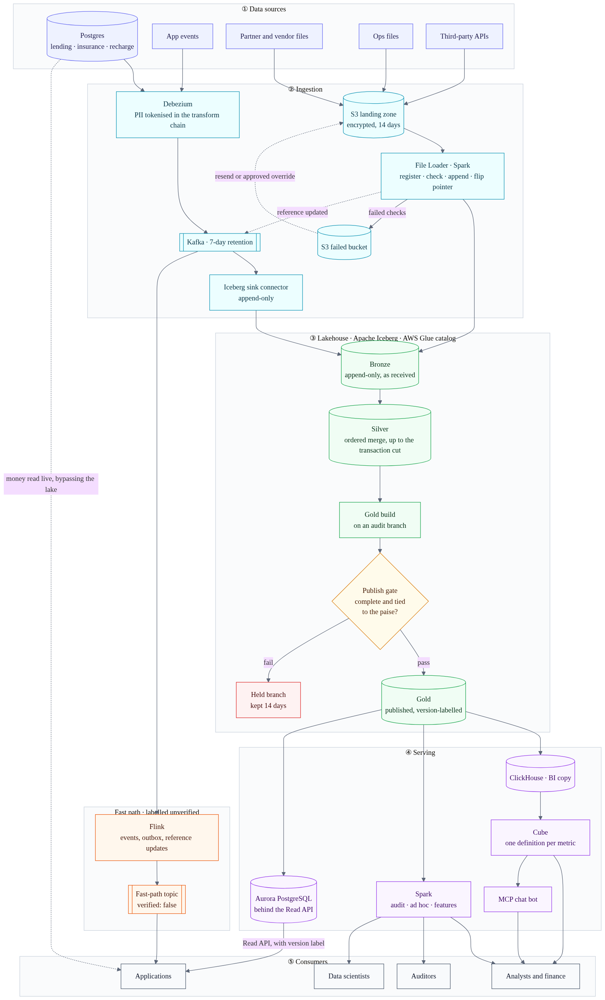
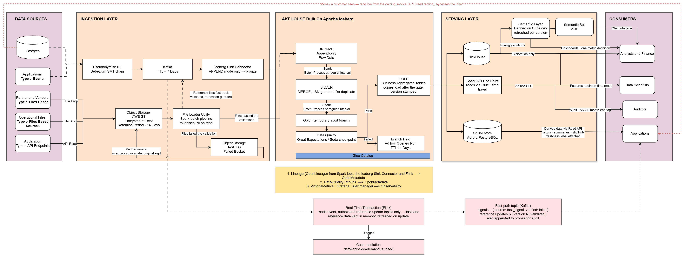

# Lakehouse Data Platform: Technical Design Document

## Document Control

| | |
|---|---|
| **Status** | Draft for review |
| **Version** | 1.0 |
| **Last updated** | 2026-10-03 |
| **Author** | `Gaurav Garg` |
| **Related documents** | Architecture diagram: [Figure 1](#61-architecture-overview), editable in [lakehouse_architecture.drawio](lakehouse_architecture.drawio) · Decision records: [00-decision-register.md](../decisions/00-decision-register.md) · Test plan: [tests/README.md](../../tests/README.md) · Runbooks: [00-runbook-index.md](../runbooks/00-runbook-index.md) · Deployment: [deploy/README.md](../../deploy/README.md) |

## 1. Executive Summary

A single lakehouse for lending, insurance and recharge, on Apache Iceberg with an AWS Glue
catalog (Figure 1). Money a customer sees is read live from its service, and an optional Flink
lane serves signals that can't wait.

Two rules hold throughout:
1. **No gold table becomes readable until it is proven correct and complete.**
2. **Every answer served from the lake or the fast path states its version, how fresh it is, and
   whether it was verified.**

Section 10 goes deep on three problems: partner file versions, completeness and correctness at
zero tolerance, and (less obvious) a consistent cut across one database's tables. Each has working
code and tests. The one-time migration is designed in section 7.2.

## 2. Background and Problem Statement

Data comes from service databases, event streams, partner files, third-party APIs and
hand-maintained Ops sheets. Analysts and finance report on it, applications read from it, data
scientists build features from it, and auditors trace numbers back to it. Today it is scattered
and inconsistent, and nobody can say whether a table is current or correct.

## 3. Goals and Non-Goals

**Goals**
- One platform for every business and source type, rebuildable from bronze.
- Every published table is provably **correct** (tied to the paise), **complete** (every declared
  input arrived) and **current** (its version and freshness stated).
- Every consumer gets an engine that suits how it reads, and the same question gets the same
  answer everywhere.
- Personal data is protected from the first byte stored, with enforceable erasure.

**Non-goals**
- A detailed plan for moving consumers off today's tables. It is sketched in 7.2.
- Automating corrections after publishing (risk 5).
- Cross-region disaster recovery. It is designed only.
- ML training and serving, choosing a BI tool, streaming joins, and chargeback.
- Blocking unsafe ad hoc queries at query time (section 7.3).

## 4. Requirements

### 4.1 Functional Requirements

| ID | Requirement |
|---|---|
| FR-1 | Ingest database changes, app events, partner files, ops sheets and API data |
| FR-2 | Tokenise personal data before anything stores it |
| FR-3 | Keep current-state tables equal to the source under replay, reordering and deletes |
| FR-4 | Keep every version of every partner file, readable "as known at" any point in five years |
| FR-5 | Publish a gold table only when it is complete and reconciled |
| FR-6 | Serve dashboards and chat, ad hoc SQL, app reads, features and audit queries |
| FR-7 | Trace any published number to its source position or file |
| FR-8 | Load existing history once, with no gap and no overlap with the live stream |
| FR-9 | *(Extension)* Serve labelled real-time signals |

### 4.2 Non-Functional Requirements

| Category | Requirement |
|---|---|
| Scale | 10k events/s peak, 500M file rows/day, ~800M rows/day in total, 50M customers, five years kept (~1.5 trillion rows) |
| Freshness | Bronze ≤2 min, silver ≤7 min, gold ≤20 min, online store ≤5 min after gold, fast path in seconds |
| Correctness | Zero tolerance: gold ties to the paise, or it isn't published |
| Durability | Kafka keeps 7 days; bronze keeps everything as received for five years |
| Availability | A failed check never takes a table offline. Its last good version keeps serving, labelled |
| Compliance | RBI, IRDAI, DPDP 2023; all data and compute in India |
| Auditability | Any month-end figure can be reproduced exactly, with lineage |

## 5. Assumptions and Constraints

| Area | Assumption |
|---|---|
| Platform | AWS, `ap-south-1` only, for data localisation |
| System of record | **The sources remain the system of record; the lake is derived.** Section 7.4 depends on this |
| Money | Signed `BIGINT` paise. Rates in integer basis points |
| Partner files | A full snapshot per (partner, feed, posting date), possibly in parts, unless the contract says changes only. Disputes are raised within 14 days |
| Control totals | Each source reports its totals for a business date once that date closes |
| Business day | Asia/Kolkata. Each partner's cut-off is declared in its contract |
| App traffic | Peak reads in the low thousands per second, which favours Aurora over DynamoDB |

## 6. High-Level Design

### 6.1 Architecture Overview

*Figure 1. The platform in five layers, rendered from
[lakehouse_architecture.mmd](lakehouse_architecture.mmd) by `make diagram`.*

*Figure 2. The detailed architecture, drawn by hand in draw.io; the editable source is
[lakehouse_architecture.drawio](lakehouse_architecture.drawio).*

Continuous sources arrive through Kafka and bounded ones through S3; gold passes the publish gate
before serving. Two lanes bypass the lake: money read live from its service, and the Flink fast
path. Lineage and check results go to OpenMetadata; metrics to VictoriaMetrics and Grafana.

### 6.2 Data Layers (Medallion)

| Layer | Holds | To get in, a record must |
|---|---|---|
| **Bronze** | Everything as received, append-only, with personal data already tokenised | Nothing is refused: unparseable rows land flagged for reprocessing, never dropped |
| **Silver** | Current state from database changes, file facts with full history, deduplicated events | Match its contract, be applied in order, and be deduplicated |
| **Gold** | Business tables, aggregates and features | Pass the gate: complete for its declared inputs, and tied to the paise |

### 6.3 Technology Choices and Alternatives Considered

The critical choices have their own decision records. All the others are in the
[decision register](../decisions/00-decision-register.md).

| Area | Chose | What it buys | Rejected | What it costs |
|---|---|---|---|---|
| Table format | Apache Iceberg | Branches to build gold out of sight; time travel for audits; an open format | Delta Lake, Hudi | We run compaction and snapshot expiry |
| Catalog | AWS Glue, with published versions ([01](../decisions/01-catalog-and-consistency.md)) | Managed, and native to AWS | Nessie, Polaris, S3 Tables | No multi-table commits; readers resolve a published version |
| Processing | Spark for batch; Flink only for the fast path ([08](../decisions/08-the-fast-path.md)) | One engine for merges, builds and backfill; seconds only where needed | One engine for everything | Two engines to run |
| Change ingestion | Debezium → Kafka → connector appends; Spark merges in order ([03](../decisions/03-database-changes-into-the-lake.md)) | Changes that replay and stay in order per key | The connector writing to silver | Two hops of latency |
| Storage | S3, partitioned on time, bucketed on merge keys | ~200 files a day per events table; merges touch only the buckets they need | Partitioning by business line × type × hour (>200,000 files a day per table) | Bucket counts are fixed per table layout |
| BI | A ClickHouse copy of published gold, with Cube ([07](../decisions/07-bi-serving.md)) | Sub-second dashboards; one definition per metric | Querying Iceberg directly | A second copy, with no history |
| Applications | Money from the owning service; Aurora for the rest ([06](../decisions/06-application-reads.md)) | Money is always current; a new version swaps in with one transaction | DynamoDB first; reading money from the lake | Two read paths in every app |

## 7. Detailed Design

### 7.1 Data Ingestion

Sources are grouped by how they behave, not by who owns them:
- **Continuous sources go through Kafka**, for replay, per-key ordering and decoupling.
- **Bounded sources skip Kafka.** They can already be re-read from S3.

Personal data is tokenised on the way in (section 8).

| Source | Route | When it misbehaves |
|---|---|---|
| **Postgres** (each business) | Debezium → Kafka → connector appends to bronze → ordered merge into silver, up to the transaction cut ([10](../decisions/10-transaction-cut.md)) | **Replays and reordering:** ignored, since only newer changes apply. **A transaction split across topics:** waits until whole. **Unchanged large column:** keeps its value. **Restore:** forces a re-snapshot. **Truncate:** fails loudly. **Stalled connector:** slot lag is alerted and capped |
| **App events** | Kafka → bronze → deduplicated in silver | **Duplicates:** removed on `event_id`. **Unparseable:** kept, flagged. **Too late for a closed date:** recorded as an exception |
| **Partner files** | S3 → File Loader: register, check, append, flip pointer ([04](../decisions/04-partner-and-ops-files.md)) | **Resend:** treated as a duplicate. **Correction:** replaces the old version. **Parts:** published only when all have arrived. **Truncated:** held. **Missing:** alert when its window closes. **Adjustments to earlier dates:** posted today; closed periods are never rewritten |
| **Ops sheets** | Same as partner files | **A change to the GL mapping** needs human approval |
| **Third-party APIs** | Raw response saved to S3 first, then the File Loader | **Retries:** re-parse from S3. **Records visible late:** each pull re-reads a lookback window and deduplicates. **Pages shifting:** paged by key, never by offset. **No completeness signal:** a periodic full sweep |
| **Reference files** | Same checks, run on arrival, then a "reference updated" event | As partner files, plus the truncation guard |

### 7.2 Initial Data Migration

Decision record: [09](../decisions/09-one-time-migration.md). The one-time load must meet the
change stream at one point:

- **Create the replication slot first,** then export from a replica (Debezium's own snapshot
  would hold the slot open for hours).
- **Load the export tagged with the slot's starting position, then stream.** The merge's
  "strictly newer" rule absorbs any overlap.
- **Archived partner files replay oldest first;** files without sequence numbers load under a
  weaker, labelled legacy contract.
- **Past gold is rebuilt** and checked against the old finance reports.

**Limit.** Current-state tables hold only today's value. So "as known at" before migration day
exists only where the source kept history tables.

**Consumers** move over gradually. Old and new run side by side, each metric's owner signs it
off, and consumers cut over one at a time, dashboards first.

### 7.3 Data Quality, Freshness and Semantics

**Correctness** is enforced by the publish gate before any reader can see gold (section 10.2).

**Completeness.** Each gold table declares its inputs, and each input proves itself complete by
its own signal (section 10.2). A late input holds only the tables that depend on it.

**Freshness and versioning.** Every published table carries a **version label**. It records:
- the positions it was built from, **one per source**, never collapsed into one number;
- when it was published;
- whether it was reconciled to the source, or only checked against silver.

Readers resolve published versions only.

**Semantics.**
- Each table has a **contract** in the Open Data Contract Standard format
  ([samples](../../contracts/README.md)): grain, keys, units and column meanings.
- **Cube defines each metric once,** for both the dashboards and the chat bot.
- **A contract check in CI** catches upstream drift that reconciliation can't see.
- **OpenMetadata** holds the glossary, the lineage and the gate's results.

**Limit.** Nothing *blocks* a wrong aggregation run directly on ClickHouse or Spark. The platform
labels what it serves; it doesn't police queries.

### 7.4 Data Serving and Access

| Consumer | Gets | Through | Freshness | Guarantee |
|---|---|---|---|---|
| **Analysts and finance** | Dashboards, chat bot, ad hoc SQL | Cube on ClickHouse; MCP bot via Cube; Spark | ~20 min | Only versions that passed the gate. Dashboard and chat agree |
| **Applications** | **Money** | The owning service's API or read replica | Live | The source itself, never a copy |
| | **Derived data** (history, summaries, eligibility) | Read API on Aurora | ~5 min after gold | One whole version per answer, with its label |
| | **Fast signals** | Fast-path Kafka topic | Seconds | Always `verified: false` |
| **Data scientists** | Features | Spark on silver's history and gold | Daily | Point-in-time: nothing leaks from after the prediction date |
| **Auditors** | Any month-end figure, traced to source | Spark on a month-end tag; OpenMetadata | Five years | Tags never expire. Lineage reaches the change-log position or file |

**One version of the truth.** Copies load only whole, labelled versions, the Read API pins the
versions behind each response, and fast-path signals are labelled unverified
([01](../decisions/01-catalog-and-consistency.md)).

### 7.5 Real-Time Fast Path (Extension)

Fraud scoring can't wait 20 minutes ([08](../decisions/08-the-fast-path.md)). Flink reads only
complete facts (app events, outbox events and reference updates, never raw change topics) and
publishes signals labelled unverified, also stored in bronze. The cost: nothing verifies them,
and live and reconciled numbers can disagree.

## 8. Security, Privacy and Compliance

- **Tokenisation** ([02](../decisions/02-personal-data-tokenisation.md)): vault-issued random
  tokens, applied in the Debezium transform chain and the File Loader, before anything stores a
  value. If the vault is down, ingestion stops rather than letting clear text through.
- **Encryption.** KMS at rest, TLS in transit. Raw files sit encrypted in the landing zone for
  14 days, the only clear values outside the sources and the vault.
- **Access.**
  - Lake Formation grants per table.
  - Readers get silver and gold views, never staging.
  - Held branches are open to on-call only.
  - Real values come only from the vault, with a stated purpose, and are logged.
- **Erasure, by retention class** set in each field's contract. Without a legal hold, the
  customer's vault entry is deleted at once (its backups expire within the erasure window), so
  every token for them becomes meaningless. Under a retention obligation (loans, policies, KYC,
  watchlists), the entry is masked outside regulatory use and deleted when the period ends.
  Month-end figures stay reproducible, and every decision is logged.

## 9. Operational Considerations

### 9.1 Orchestration and Maintenance

Airflow schedules file loads, gold builds, their gates, and maintenance. The gate is a blocking
task, never a step data flows through. Compaction and snapshot expiry run on **closed partitions
only**, because compacting a live partition collides with the writer.

### 9.2 Monitoring and Alerting

Table lag behind sources; paise breaks (target zero, any break pages); open held branches;
transaction-cut lag; replication-slot lag; files per partition; commit retries; and fast-path
drift from gold.

### 9.3 Failure Modes and Recovery

| Failure | Recovery |
|---|---|
| Kafka consumer down < 7 days | Resume from offsets; replay is safe |
| Down > 7 days, or a database restored | Re-snapshot with a new incarnation; sweep rows the snapshot didn't see |
| Gate fails | Held; the previous version keeps serving, labelled |
| Bad code deployed | Roll back the snapshot; rebuild from bronze |
| Vault down | Ingestion stops, by design; watch slot lag |
| Region lost | `ap-south-2` recovery is designed, not built or rehearsed |

On-call procedures for these failures are in the [runbooks](../runbooks/00-runbook-index.md).

### 9.4 Cost

Order of magnitude only, not modelled. Always-on compute (MSK, Kafka Connect, Spark, Flink) costs
most, then ClickHouse and Aurora, then about 60 TB of storage. Month-end tags pin files forever,
which makes them the one retention decision with unbounded cost.

## 10. Key Technical Challenges (Deep Dives)

**How these were chosen.** About 37 ways the sources misbehave were listed. A problem counts as
hard only if it happens routinely, gives a plausible wrong answer that passes natural checks, has
no off-the-shelf fix, and affects trusted numbers. Out-of-order changes to one key didn't qualify:
the ordered merge (section 7.1) is standard practice. Nor did incremental API pulls: the
discipline in section 7.1 covers them. Three larger problems are named in section 14.

### 10.1 Partner Files: Which Version Is the Truth, and Is It Whole?

**Why it's hard.** A delivery (partner, feed, posting date) can arrive in parts, twice, corrected,
older-after-newer, or truncated. Each part can tie to its own trailer while the delivery is wrong.

**Guarantee.** A version publishes only when all its parts have arrived. An older version never
wins, however publishes race. No part loads twice, even after a crash. A version far smaller than
the same weekday usually is gets held. "As known at" works for any past moment.

**Design** ([04](../decisions/04-partner-and-ops-files.md),
[code](../../src/lakehouse/ingestion/partner_files.py)). Register each part with its version and
place in the manifest; check it whole; load it by replacing any rows with its file ID, so reruns
and racing workers load it once; then flip the current-version pointer by compare-and-set,
decided inside one MERGE.

**Trade-offs.** Readers go through the pointer, every version is stored, and a new feed has no
baseline for the truncation guard.

### 10.2 Completeness and Correctness at Zero Tolerance

**Why it's hard.** Each source proves completeness differently, and keeps moving while we compare:

| Source | Proof of completeness |
|---|---|
| Partner files | A current version of the delivery, and the arrival calendar |
| Databases | The transaction cut has passed the date's cut-off (section 10.3) |
| APIs | A periodic full sweep; otherwise labelled unverifiable |
| App events | None, so events never feed money |

**Guarantee.** No gold version is readable unless every input is complete by its own signal and
every (business line, date) ties exactly on count, signed paise, distinct keys and a content
fingerprint.

**Design** ([05](../decisions/05-the-publish-gate.md),
[code](../../src/lakehouse/publishing/publish_gate.py)). Build on a branch, replacing the whole
date window. Compare with a full outer join against a **pinned** reference: silver at the snapshot
the build read, not silver now, and the source's totals after close. Only the fingerprint catches
₹5,000 moved between customers. It is a 32-bit hash per row, summed, defined identically for
Postgres and Spark, so it cannot overflow. Publish by `fast_forward`, or hold.

**Trade-offs.** Sources must report daily totals, and the intraday check can't see a change lost
before silver.

### 10.3 A Consistent Cut Across One Database (Hidden)

**Why it's hidden.** One transaction (a loan and two ledger lines) lands as events on different
partitions at different moments. Silver briefly holds the loan alone, and gold built then **ties to
silver** because silver itself is torn. Idle and lagging partitions also look the same, so "is the
day complete?" has no answer.

**Guarantee.** Gold never reads a half-applied transaction, and a date is complete only when every
transaction before its cut-off is in silver.

**Design** ([10](../decisions/10-transaction-cut.md),
[code](../../src/lakehouse/ingestion/transaction_cut.py)). Debezium's transaction records give
each transaction's event count per table. The cut is the longest prefix of transactions whose
events have all landed. Every table of the source merges up to it and is tagged with it, and gold
reads all inputs at one tag.

**Trade-offs.** Silver is as fresh as the slowest partition, and one failed merge holds the source.

## 11. Testing Strategy

Every test provokes a plausible **wrong answer**, not a crash, and asserts the specific wrong
result a broken design would produce.
- Guarantees that rest on engine behaviour run against a real Iceberg engine: 31 tests, a few
  minutes.
- **Mutation testing:** each of 20 guards is broken in turn, and a test must fail. All 20 are
  caught.

The [test plan](../../tests/README.md) maps each test to the wrong answer it prevents, lists the
cases planned but not yet written, and explains how to run them.

## 12. Risks and Mitigations

**Where it breaks first.** Silver's merge at peak. Merge-on-read delete files pile up faster than
compaction clears them, merges slow down, and the transaction cut, which waits for every table of
a source, falls behind. Gold then holds and goes stale. It fails safe (stale and labelled, never
wrong), and it is the first thing to load-test (risk 1).

| # | Risk | Impact | Mitigation |
|---|---|---|---|
| 1 | Merge throughput and small files at peak (unmeasured) | Silver misses its freshness target | Load-test before go-live; compact closed partitions; if needed, move the merge to Flink with the same guards |
| 2 | One late input holds many tables | Dependent tables go stale | Per-table completeness; held tables keep serving, labelled |
| 3 | Metric definitions drift from schemas | Wrong numbers everywhere, invisible to reconciliation | The contract check in CI |
| 4 | A copy loses its version label | Stale numbers served with full confidence | Version-stamped copies; the Read API refuses unlabelled data; lag alerts |
| 5 | A correction after publishing | Must reach gold, every copy and the cache; the month-end tag can't change | A manual procedure ([runbook](../runbooks/publish-gate-held.md)): rebuild through the gate, reload the copies, and book the adjustment in the current month. Not automated (non-goal, section 3) |

## 13. Open Questions

- **Schema registry:** Confluent works with today's configuration; Glue is native to AWS but needs
  that configuration changed.
- **Landing retention:** 14 days holds only if every partner's dispute window is 14 days or less.
- **App read traffic** is unmeasured. Above the low thousands per second, DynamoDB replaces Aurora
  ([06](../decisions/06-application-reads.md)).
- **Vault throughput at 10k events/s** is unmeasured. The fallback is in
  [02](../decisions/02-personal-data-tokenisation.md).

## 14. Honesty: Limitations, Uncertainties and AI Use

**Deliberately left out.** See Non-goals (section 3).

**Not solved here:** restatement of closed periods (a manual runbook); matching one bank credit
to many transactions net of fees; and source purges that arrive as deletes.

**Where I'm unsure:** Debezium's transaction records and the Postgres fingerprint are taken from
documentation and a reference implementation, not run; Cube's version-bound refresh on the
deployed version; and Glue's commit behaviour versus the test catalog.

**Status of the code.** `src/` implements the three hard problems and the ordered merge. The
plumbing around them is stubbed in `src/lakehouse/pipeline.py`, each stub stating its guarantee.
Tests run on a real Iceberg engine, and mutation testing shows every guard is tested. The gate's
checks are Spark functions a Great Expectations or Soda checkpoint would call; that wiring isn't
built.

**Use of AI.** 

I used Claude throughout: to draft documents, code and tests, to set out options and trade-offs,
and to run probes against a real Iceberg engine. The decisions are mine, including several that
went against its first suggestion:
- Iceberg with ClickHouse, and strict medallion layers;
- Cube with an MCP bot on gold;
- Glue over Nessie and Polaris;
- an append-only connector, after seeing what upserts lose;
- Great Expectations or Soda for the gate;
- Aurora over DynamoDB, and Spark over Trino for audits;
- a fast path for events and reference files;
- partner files as a hard problem, solved the standard way;
- choosing the hard problems from how the sources misbehave, not from the design;
- removing the semantic validator;
- the final architecture diagram, which I drew.

I checked the work by running it, not by reading it. Testing against a real engine, and deleting
every guard to confirm a test fails, found bugs in code that had already been reviewed.

## Appendix A: Glossary

| Term | Meaning |
|---|---|
| Bronze, silver, gold | As received; merged and conformed; business-ready and verified |
| Change-log position | A database's own ordering of its changes (the Postgres LSN), used to apply changes in order |
| The gate | The check a gold table passes on a temporary branch before readers can see it |
| Held branch | A gold build that failed its check: kept 14 days for investigation, never published |
| Version label | On every published table and answer: source positions, when published, whether reconciled |
| Current-version pointer | Which file is current for each (partner, feed, date); it only flips to a newer sequence number |
| Transaction cut | The newest point up to which every transaction of one database has fully landed, across all its tables; silver advances only to it |
| Outbox event | A business fact written in the same database transaction as the change it describes |
| Tokenisation | Replacing personal data with a random, vault-issued token before anything stores it |
| Fast path | The Flink lane serving labelled, unverified signals in seconds |

## Appendix B: Sizing

| Quantity | Working | Result |
|---|---|---|
| Events per day | 10k/s peak ÷ 3 × 86,400 | ~290M |
| Rows per day | 290M + 500M file rows | ~800M |
| Rows kept | 800M × 365 × 5 | ~1.46 trillion |
| Iceberg footprint | 1.46 trillion × ~40 bytes (Parquet, zstd) | ~58 TB |
| Kafka retention | ~3 MB/s average × 7 days × 3 replicas | ~5 TB |
| Kafka partitions | Sized for consumer parallelism; throughput alone needs 2 | ~540 |
| Files per day (one events table) | 24 hourly partitions × ~8 after compaction | ~200 |
